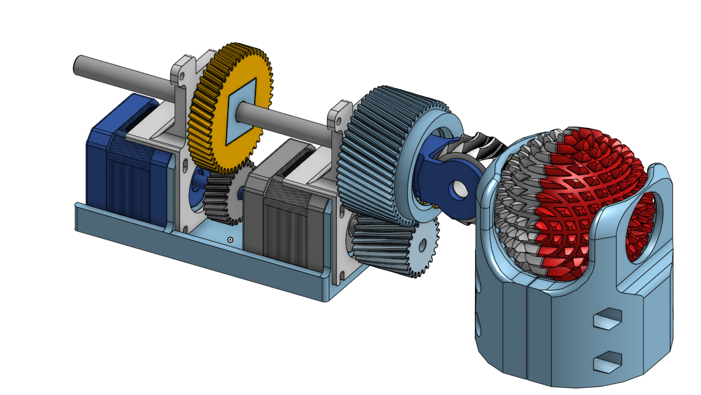

# Cross Spherical gear actuation

#### Original work here:

  <a href="https://www.youtube.com/watch?v=hhDdfiRCQS4">
     
    Watch the original work on youtube.
  </a>

# My implementation 

## Overview

  
  

# ABENICS 3-DoF Active Ball-Joint Actuator

ABENICS is an open-source, 3D-printed active ball-joint actuator offering three degrees of freedom (3-DoF) via a novel cross-spherical gear meshing. This implementation replaces high-cost brushless DC motors with affordable NEMA17 steppers, driven by TMC2208 drivers and a Teensy 4.0 microcontroller overclocked to 916 MHz.

---

## 🏷️ Table of Contents

1. [Key Features](#-key-features)  
2. [Hardware Components](#-hardware-components)  
3. [Mechanical Design](#-mechanical-design)  
4. [Electronics & Firmware](#-electronics--firmware)  
5. [Getting Started](#-getting-started)  
6. [Bill of Materials (BOM)](#-bill-of-materials-bom)  
7. [Future Improvements](#-future-improvements)  
8. [Contributing](#-contributing)  
9. [License](#-license)

---

## 🔑 Key Features

- **Compact 3-DoF Mechanism**  
  Cross-spherical gear couples two orthogonal rotations into a single ball-joint output.  
- **Affordable Actuation**  
  Four NEMA17 stepper motors (two per actuator) instead of BLDC units.  
- **Quiet & Precise**  
  TMC2208 drivers in stealthChop mode for smooth, low-noise micro-stepping.  
- **High-Performance Control**  
  Teensy 4.0 @ 916 MHz handles inverse kinematics, motor control, UI, and sensors.  
- **Fully 3D-Printed**  
  All structural parts and gears made on FDM machines—no custom machining.

---

## 🛠️ Hardware Components

| Component              | Specification                                    | Qty  |
|------------------------|--------------------------------------------------|:----:|
| NEMA17 Stepper Motor   | 1.8° step angle, 59 N·cm holding torque          | 4    |
| Trinamic TMC2208       | UART, stealthChop & coolStep                     | 4    |
| Teensy 4.0             | Overclocked to 916 MHz, FreeRTOS                  | 1    |
| 3D-Printed Parts       | PLA/ABS on ≥ 200 mm³ build volume                 | —    |
| Ball Bearings          | 8 mm ID × 16 mm OD × 5 mm width                   | 8    |
| Optional Magnetic Encoder | e.g. AS5048 for closed-loop feedback          | 2    |

---

## ⚙️ Mechanical Design

1. **Cross-Spherical Gear**  
   - Two input bevel gears mesh with a central spherical “crown” gear.  
   - Converts dual-axis rotation into omni-directional ball-joint motion.  
2. **Actuator Assembly**  
   - Steppers at 90° orientation in a compact housing.  
   - Press-fit bearings ensure smooth rotation.  
3. **Mounting & Integration**  
   - Modular flange design for easy attachment.  
   - Integrated cable-chain guide built into the frame.

---

## 📡 Electronics & Firmware

### Stepper Control

- TMC2208 configured for 1/16 micro-stepping, 1.2 A current limit  
- UART interface for stealthChop tuning  

### Teensy 4.0

- Runs FreeRTOS tasks for:  
  - Motor driver communication  
  - Inverse kinematics solver  
  - UI (OLED/serial menu)  
  - Sensor acquisition  

### Repository Structure

   

The gear system is driven by actuators, each equipped with two NEMA17 stepper motors. These motors provide the necessary torque and precision for the gear mechanism. The TMC2208 stepper motor drivers, controlled by an overclocked Teensy4.0 microcontroller, ensure smooth and accurate motor operation. The Teensy4.0 is overclocked to 916 MHz to handle all four motors, inverse kinematics, UI, and sensor feedback.

All components are 3D printed on FDM printers.
